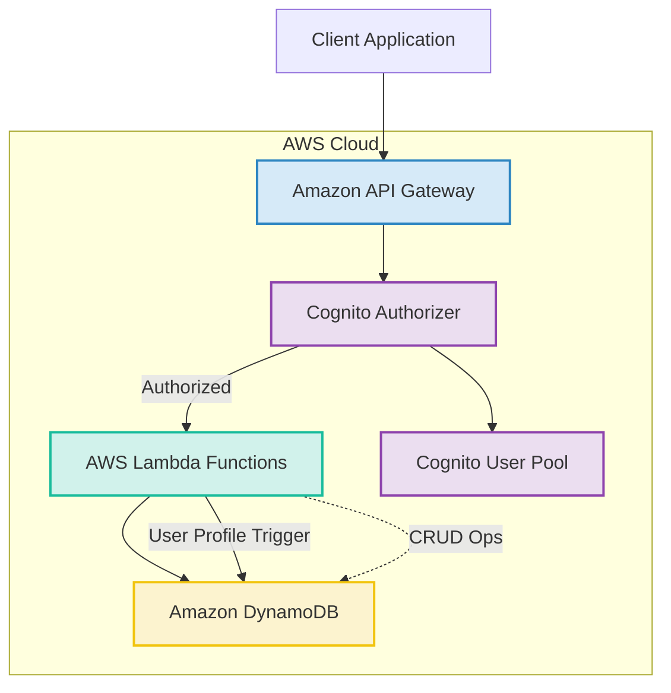

# System Patterns: Scalable API Service

## 1. System Architecture Overview

The system employs a serverless architecture on AWS, designed for scalability, cost-effectiveness, and maintainability.

- **API Layer:** Amazon API Gateway acts as the front door for all incoming API requests. It handles request routing, validation (basic), and integrates with Amazon Cognito for authorization.
- **Compute Layer:** AWS Lambda functions execute the core business logic for each API endpoint. Each function is a small, independent unit responsible for a specific CRUD operation or business task.
- **Data Layer:** Amazon DynamoDB serves as the primary data store. A single-table design pattern is utilized for flexibility and performance, accommodating the different entities (Users, Posts, Tags) and their relationships.
- **Authentication Layer:** Amazon Cognito manages user identities, authentication (sign-up, sign-in), and issues JWT tokens for authorizing API requests.

## 2. Key Technical Decisions

- **Serverless First:** Prioritizing AWS Lambda, API Gateway, and DynamoDB to minimize operational overhead and leverage auto-scaling and pay-per-use pricing.
- **Infrastructure as Code (IaC):** AWS Cloud Development Kit (CDK) in TypeScript is used to define and manage all cloud resources. This ensures reproducibility, version control, and easier environment management.
- **TypeScript for Codebase:** Both Lambda functions and CDK infrastructure code are written in TypeScript for strong typing, improved maintainability, and better developer experience.
- **Single-Table Design for DynamoDB:** Chosen for its performance benefits at scale and flexibility in handling diverse access patterns and relationships between entities within a single table.
- **JWT for Authentication:** Standard JSON Web Tokens issued by Cognito are used for stateless API authentication.
- **RESTful API Design:** Adherence to REST principles for API endpoints, ensuring a standard and predictable interface. API documentation will be generated from code metadata where possible.
- **Dedicated Lambda per Endpoint:** Each API operation (e.g., `POST /posts`, `GET /posts/{postId}`) maps to a dedicated Lambda function. This promotes separation of concerns and simplifies function logic.
- **Test-Driven Development (TDD):** Development will exclusively follow TDD, ensuring tests are written before code, guiding implementation and guaranteeing coverage.
- **API Versioning:** Path-based versioning (e.g., `/v1/`) will be used from the start to manage API evolution and breaking changes.
- **Standardized Error Handling & Resilience:** Implement consistent HTTP error codes and messages. Employ retry mechanisms (e.g., exponential backoff via AWS SDK) for transient failures.
- **Comprehensive Observability:** Integrate AWS CloudWatch (Logs, Metrics, Alarms) and AWS X-Ray for robust monitoring, logging, and tracing across the application.
- **Proactive Cost Management:** Utilize AWS Cost Explorer and Budgets for monitoring and controlling expenses, coupled with resource optimization.
- **Schema Evolution Strategy:** Plan for flexible schemas and employ batch migrations (e.g., using Lambda) for future data model changes in DynamoDB.

## 3. Design Patterns

- **Repository Pattern (Conceptual):** While not explicitly implemented with classes in a traditional sense for each Lambda, the interaction with DynamoDB within Lambda functions will be structured. Helper functions or modules will encapsulate DynamoDB query logic for specific entities or access patterns, promoting reusability and separation of data access logic from business logic.
- **Middleware (API Gateway Authorizer):** Cognito authorizers act as middleware to handle authentication and authorization before requests reach the Lambda functions.
- **Event-Driven (Cognito Trigger):** The creation of a user profile in DynamoDB is triggered by a Cognito PostConfirmation event, demonstrating an event-driven pattern for decoupling user sign-up from profile persistence.
- **Single Responsibility Principle (Lambda Functions):** Each Lambda function is designed to handle a single, well-defined task corresponding to an API endpoint.
- **Token-Based Authentication for Programmatic Access (Future - PATs):** A system for generating, storing (hashed), and validating Personal Access Tokens to allow users to grant programmatic access to their accounts.

## 4. Component Relationships

- **API Gateway & Lambda:** API Gateway routes HTTP requests to the appropriate Lambda function based on path and method. It passes request payloads and path parameters to the Lambda.
- **Lambda & DynamoDB:** Lambda functions interact with DynamoDB to perform CRUD operations. They construct queries, put items, update items, and delete items based on the business logic and access control rules.
- **Lambda & Cognito:**
  - User-facing Lambdas (e.g., `/me`) might interact with Cognito to fetch user attributes if not fully available in the JWT or DynamoDB profile.
  - A specific Lambda function is triggered by Cognito (PostConfirmation) to create the user's profile in DynamoDB after successful sign-up.
- **Cognito & API Gateway:** Cognito User Pool is configured as an authorizer for API Gateway, validating JWTs in incoming requests.
- **Entities (User, Post, Tag) in DynamoDB (Single-Table Design):**

  - All entities reside in a single DynamoDB table (e.g., `SocialDB`). IDs (e.g., `post_id`, `tag_id`, `user_id`) should be globally unique (e.g., UUIDs).
  - **Users:**
    - `PK = USER#{user_id}`, `SK = PROFILE`
    - Attributes: `{email, created_at, updated_at, ...}`
  - **Posts:**
    - `PK = POST#{post_id}`, `SK = DETAILS`
    - Attributes: `{name, content, user_id (owner), access_type ("public" | "private" | "allowed_user"), created_at, updated_at, ...}`
  - **Allowed Users for a Post:**
    - `PK = POST#{post_id}`, `SK = ALLOWED_USER#{user_id}`
    - This structure links a user who is allowed to view a specific post.
  - **Tags:**
    - `PK = TAG#{tag_id}`, `SK = DETAILS`
    - Attributes: `{name, user_id (owner), access_type ("public" | "private"), created_at, updated_at, ...}`
  - **Post-Tag Relationships (Many-to-Many):**

    - `PK = POST#{post_id}`, `SK = TAG#{tag_id}` (To find all tags for a post)
    - `PK = TAG#{tag_id}`, `SK = POST#{post_id}`
      - Attributes: `{ post_created_at }` (timestamp of the associated post's creation, for sorting in GSI)
      - (Used to find all posts for a tag, queryable on main table by PK, and via GSI4 for sorting by post creation date)

  - **Global Secondary Indexes (GSIs):**
    - **GSI1 (UserPostsIndex):** For listing posts by user.
      - `GSI1PK = USER#{user_id}` (maps to `user_id` attribute on Post items)
      - `GSI1SK = created_at` (for sorting posts by creation time)
    - **GSI2 (AccessTypePostsIndex):** For listing public posts.
      - `GSI2PK = access_type` (e.g., "public")
      - `GSI2SK = created_at` (for sorting posts by creation time)
    - **GSI3 (AllowedUserPostsIndex):** For listing posts where a user is an allowed user.
      - Query `Allowed Users` items: `PK = POST#{post_id}, SK = ALLOWED_USER#{user_id}`. Then fetch Post details.
      - Alternative GSI for direct query: `GSI3PK = ALLOWED_USER#{user_id}` (maps to `user_id` on `Allowed Users` items), `GSI3SK = POST#{post_id}`. This allows finding all posts a user is explicitly allowed to see.
    - **GSI4 (TagPostsSortedIndex):** For listing posts associated with a specific tag, sorted by post creation date.
      - Projects items where `PK = TAG#{tag_id}` and `SK = POST#{post_id}`.
      - `GSI4PK = TAG#{tag_id}`
      - `GSI4SK = post_created_at` (attribute on the relationship item)
  - **Personal Access Tokens (PATs) (Future):**
    - `PK = USER#{user_id}`, `SK = PAT#{token_id}`
    - Attributes: `{hashed_token, name, scopes (e.g., ["read:posts", "write:posts"]), expires_at, last_used_at, created_at}`
    - Note: The actual token value is shown to the user once upon creation and is not stored directly. Only a cryptographically secure hash (e.g., SHA256) of the token is stored.

### 4.1 Key Query Patterns

- **Get Post by ID:** Query table: `PK = POST#{post_id}, SK = DETAILS`.
- **Get All Posts by a Specific User:** Query GSI1: `GSI1PK = USER#{user_id}`.
- **Get All Public Posts:** Query GSI2: `GSI2PK = "public"`.
- **Get All Posts an Authenticated User is Allowed to See (explicitly):** Query GSI3 (if implemented as `GSI3PK = ALLOWED_USER#{user_id}`), or query `Allowed Users` items by `user_id` and then fetch corresponding `POST` items.
- **Get All Posts Accessible to an Authenticated User (Combined Logic):**
  1. Fetch user's own posts (via GSI1).
  2. Fetch all public posts (via GSI2).
  3. Fetch posts where the user is an allowed user (via GSI3 or direct queries).
  4. Combine and deduplicate results in the application layer or Lambda.
- **Get Tags for a Post:** Query table: `PK = POST#{post_id}`, `SK` begins_with `TAG#`.
- **Get User Profile:** Query table: `PK = USER#{user_id}`, `SK = PROFILE`.

## 5. Critical Implementation Paths

- **Authentication Flow:**
  - **Cognito JWTs:** Ensuring seamless user sign-up, login, JWT issuance by Cognito, and token validation at the API Gateway for user-facing interactions. All communications must use HTTPS.
  - **Personal Access Tokens (PATs) (Future):** For programmatic access, a separate authentication mechanism will validate PATs. This might involve a custom API Gateway authorizer or direct validation logic within Lambda functions. PATs would be passed via an `Authorization: Bearer <PAT>` header.
- **Access Control Logic:**
  - Implementing robust and correct access control checks within each relevant Lambda function, considering both Cognito JWT authenticated users and PAT authenticated requests.
  - **Cognito Integration:** API Gateway uses Cognito authorizers to validate JWTs. Authenticated user identity (e.g., `user_id` or `sub`) is passed to Lambda functions.
  - **PAT Validation (Future):**
    - Extract token from `Authorization` header.
    - Look up the hashed token in DynamoDB (e.g., `PK = USER#{user_id}, SK = PAT#{token_id}`, potentially using a GSI on the hashed token if user context isn't available initially, though PATs are typically user-specific).
    - Verify token is not expired and has necessary scopes for the requested operation.
  - **Lambda Authorization for Posts (applies to both JWT and PAT context):**
    - `private`: `user_id` associated with the token (JWT or PAT) must match Post's `user_id`.
    - `public`: Accessible if user/token is authenticated.
    - `allowed_user`: Check if an item `PK = POST#{post_id}, SK = ALLOWED_USER#{user_id_from_token}` exists.
  - **Lambda Authorization for Tags (applies to both JWT and PAT context):**
    - `private`: `user_id` associated with the token must match Tag's `user_id` for viewing and assignment.
    - `public`: Viewable and assignable if user/token is authenticated.
  - **IAM Least Privilege:** Lambda execution roles must have minimal necessary permissions.
  - **Error Responses:** Standard HTTP status codes (401, 403, 404).
- **DynamoDB Single-Table Design & Querying:**
  - Correctly modeling entities and their relationships in the single-table design as detailed in Section 4.
  - Crafting efficient DynamoDB queries using Primary Keys and GSIs for various access patterns.
  - Ensuring globally unique IDs (e.g., UUIDs) for `post_id` and `tag_id`.
  - Planning for potential hot partitions and using on-demand capacity.
- **Local Development Environment Setup:** Providing a smooth and reliable local development experience that accurately simulates the AWS environment (API Gateway, Lambda, DynamoDB Local) is crucial for developer productivity. This includes the API explorer UI, with documentation generated from code metadata.
- **CDK Infrastructure Deployment:** Ensuring the CDK stacks deploy all resources correctly and consistently across environments.
- **Input Validation:** Implementing thorough input validation in each Lambda function (e.g., using `zod` or `Joi`), driven by TDD, to ensure data integrity and security.
- **API Documentation Generation:** Leveraging code metadata (e.g., TypeScript types, JSDoc) to generate OpenAPI specifications for the API Explorer.
- **Scalability and Performance Optimization:**
  - **Lambda:** Optimize memory allocation; use provisioned concurrency for critical/high-traffic endpoints to mitigate cold starts.
  - **DynamoDB:** Utilize on-demand capacity mode for automatic scaling; use batch operations (`BatchGetItem`, `BatchWriteItem`) where appropriate.
  - **API Gateway:** Configure appropriate throttling limits; enable caching for frequently accessed GET requests with suitable TTLs.
    - **Cache TTLs (Initial Values):**
      - `GET /v1/me` (User Profile): **300 seconds (5 minutes)**.
      - `GET /v1/posts/{postId}` (Public Posts): **60 seconds (1 minute)**. (Primarily for public, non-personalized data).
      - `GET /v1/posts` (Public Post Listings): **30 seconds**.
      - `GET /v1/tags/{tagId}` (Public Tags): **60 seconds (1 minute)**.
      - `GET /v1/tags` (Public Tag Listings): **30 seconds**.
      - Note: These are starting points and should be tuned. Caching is most effective for public data; personalized data caching at API Gateway requires careful cache key design.
  - **Implementing Observability:**
  - **Logging:** Implement structured logging in Lambda functions, sending logs to CloudWatch Logs. Include request IDs and user context.
  - **Metrics:** Monitor key performance indicators (KPIs) like Lambda invocation count, duration, error rate, and DynamoDB read/write capacity units using CloudWatch Metrics.
  - **Alarms:** Set up CloudWatch Alarms for critical thresholds. These are initial suggestions and should be tuned based on observed baselines:
    - **Lambda Errors (per function):**
      - `Errors >= 5` in 5 minutes.
      - `ErrorRate >= 1%` over 15 minutes.
    - **Lambda Duration (P95 or P99 - per function):**
      - `P95 Duration > 1000ms` for 3 consecutive periods of 1 minute (adjust per function).
    - **API Gateway Latency (P95 or P99 - per API):**
      - `P95 Latency > 1500ms` for 3 consecutive periods of 1 minute.
    - **API Gateway 5XX Errors (per API):**
      - `5XXError Count >= 5` in 5 minutes.
      - `5XXError Rate >= 1%` over 15 minutes.
    - **DynamoDB Throttling (Read/Write - per table/GSI):**
      - `ReadThrottleEvents >= 10` in 5 minutes.
      - `WriteThrottleEvents >= 10` in 5 minutes.
    - **Cognito User Pool Errors (e.g., SignInThrottles):**
      - `SignInThrottles > 5` in 1 minute.
  - **Tracing:** Enable AWS X-Ray for end-to-end request tracing across API Gateway and Lambda functions to diagnose performance bottlenecks and errors.

## 6. Code Quality and Development Workflow

- **Development Methodology:** Exclusive Test-Driven Development (TDD).
- **ESLint & Prettier:** Enforced for consistent code style and quality.
- **TypeScript Strict Mode:** Maximizing type safety.
- **Unit Testing (Jest):** Writing tests before application code for all Lambda function logic, including mocking AWS services (e.g., `aws-sdk-client-mock` for SDK v3).
- **Integration Testing:** Testing the API endpoints end-to-end, potentially against the local simulated environment, with tests also written in a TDD fashion where applicable.
- **Extended Testing:** Incorporate load testing (e.g., Artillery, Locust), security testing (e.g., OWASP ZAP), and performance testing into the CI/CD pipeline or as regular checks.
- **Pre-commit Hooks (Husky/Lint-Staged):** Automating linting and formatting before commits.
- **CI/CD Pipeline:** Automating testing (unit, integration, extended tests) and deployment processes.
