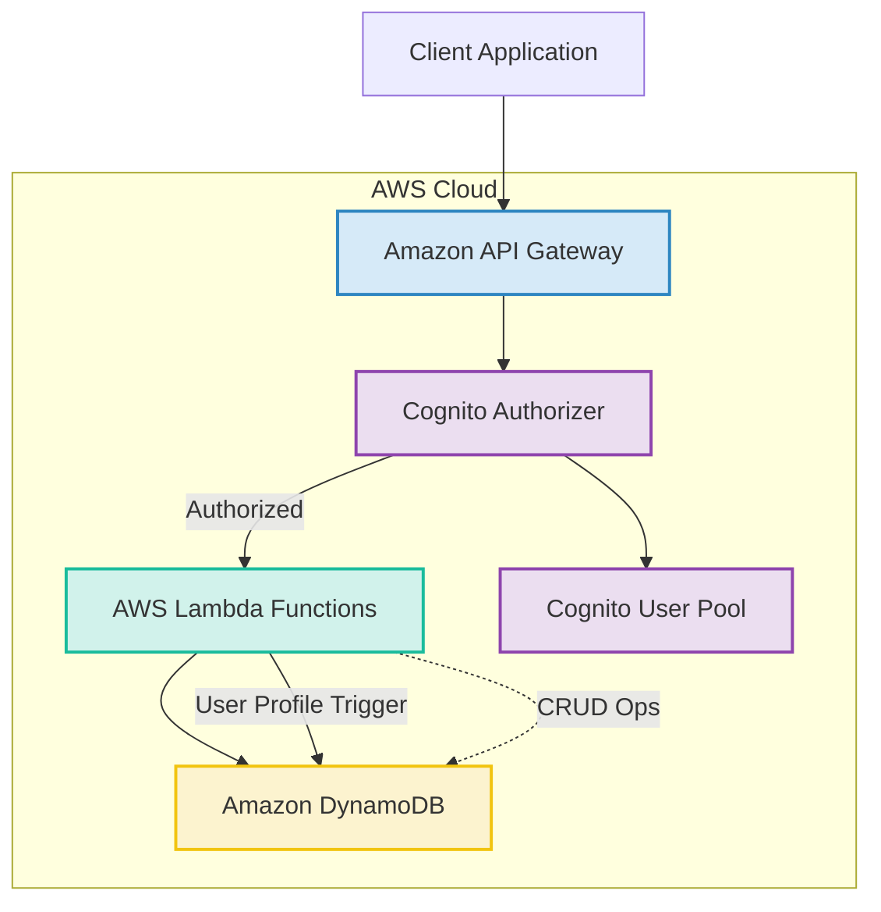

# System Patterns: Scalable API Service

## 1. System Architecture Overview
The system employs a serverless architecture on AWS, designed for scalability, cost-effectiveness, and maintainability.
- **API Layer:** Amazon API Gateway acts as the front door for all incoming API requests. It handles request routing, validation (basic), and integrates with Amazon Cognito for authorization.
- **Compute Layer:** AWS Lambda functions execute the core business logic for each API endpoint. Each function is a small, independent unit responsible for a specific CRUD operation or business task.
- **Data Layer:** Amazon DynamoDB serves as the primary data store. A single-table design pattern is utilized for flexibility and performance, accommodating the different entities (Users, Posts, Tags) and their relationships.
- **Authentication Layer:** Amazon Cognito manages user identities, authentication (sign-up, sign-in), and issues JWT tokens for authorizing API requests.

## 2. Key Technical Decisions
- **Serverless First:** Prioritizing AWS Lambda, API Gateway, and DynamoDB to minimize operational overhead and leverage auto-scaling and pay-per-use pricing.
- **Infrastructure as Code (IaC):** AWS Cloud Development Kit (CDK) in TypeScript is used to define and manage all cloud resources. This ensures reproducibility, version control, and easier environment management.
- **TypeScript for Codebase:** Both Lambda functions and CDK infrastructure code are written in TypeScript for strong typing, improved maintainability, and better developer experience.
- **Single-Table Design for DynamoDB:** Chosen for its performance benefits at scale and flexibility in handling diverse access patterns and relationships between entities within a single table.
- **JWT for Authentication:** Standard JSON Web Tokens issued by Cognito are used for stateless API authentication.
- **RESTful API Design:** Adherence to REST principles for API endpoints, ensuring a standard and predictable interface. API documentation will be generated from code metadata where possible.
- **Dedicated Lambda per Endpoint:** Each API operation (e.g., `POST /posts`, `GET /posts/{postId}`) maps to a dedicated Lambda function. This promotes separation of concerns and simplifies function logic.
- **Test-Driven Development (TDD):** Development will exclusively follow TDD, ensuring tests are written before code, guiding implementation and guaranteeing coverage.

## 3. Design Patterns
- **Repository Pattern (Conceptual):** While not explicitly implemented with classes in a traditional sense for each Lambda, the interaction with DynamoDB within Lambda functions will be structured. Helper functions or modules will encapsulate DynamoDB query logic for specific entities or access patterns, promoting reusability and separation of data access logic from business logic.
- **Middleware (API Gateway Authorizer):** Cognito authorizers act as middleware to handle authentication and authorization before requests reach the Lambda functions.
- **Event-Driven (Cognito Trigger):** The creation of a user profile in DynamoDB is triggered by a Cognito PostConfirmation event, demonstrating an event-driven pattern for decoupling user sign-up from profile persistence.
- **Single Responsibility Principle (Lambda Functions):** Each Lambda function is designed to handle a single, well-defined task corresponding to an API endpoint.

## 4. Component Relationships
- **API Gateway & Lambda:** API Gateway routes HTTP requests to the appropriate Lambda function based on path and method. It passes request payloads and path parameters to the Lambda.
- **Lambda & DynamoDB:** Lambda functions interact with DynamoDB to perform CRUD operations. They construct queries, put items, update items, and delete items based on the business logic and access control rules.
- **Lambda & Cognito:**
    - User-facing Lambdas (e.g., `/me`) might interact with Cognito to fetch user attributes if not fully available in the JWT or DynamoDB profile.
    - A specific Lambda function is triggered by Cognito (PostConfirmation) to create the user's profile in DynamoDB after successful sign-up.
- **Cognito & API Gateway:** Cognito User Pool is configured as an authorizer for API Gateway, validating JWTs in incoming requests.
- **Entities (User, Post, Tag) in DynamoDB:**
    - **User** items store profile information.
    - **Post** items store post content and metadata, including a `user_id` to link to the owning User.
    - **Tag** items store tag information, including a `user_id` to link to the owning User.
    - **Relationships (Post-Tag, Post-AllowedUser):** Modeled using composite sort keys or secondary items.
        - `Post-Tag`: `PK=POST#<post_id>, SK=TAG#<tag_id>`
        - `Allowed User for Post`: `PK=POST#<post_id>, SK=ALLOWED_USER#<user_id>`

## 5. Critical Implementation Paths
- **Authentication Flow:** Ensuring seamless user sign-up, login, JWT issuance, and token validation at the API Gateway.
- **Access Control Logic:** Implementing robust and correct access control checks within each relevant Lambda function for Posts and Tags (private, public, allowed_user). This is critical for data security.
- **DynamoDB Single-Table Design & Querying:** Correctly modeling entities and their relationships in the single-table design. Crafting efficient DynamoDB queries for various access patterns (e.g., fetching posts for a user, fetching posts accessible to a user, checking allowed users).
- **Local Development Environment Setup:** Providing a smooth and reliable local development experience that accurately simulates the AWS environment (API Gateway, Lambda, DynamoDB Local) is crucial for developer productivity. This includes the API explorer UI, with documentation generated from code metadata.
- **CDK Infrastructure Deployment:** Ensuring the CDK stacks deploy all resources correctly and consistently across environments.
- **Input Validation:** Implementing thorough input validation in each Lambda function (e.g., using `zod` or `Joi`), driven by TDD, to ensure data integrity and security.
- **API Documentation Generation:** Leveraging code metadata (e.g., TypeScript types, JSDoc, or decorators if a framework like NestJS were used conceptually) to generate OpenAPI specifications for the API Explorer.

## 6. Code Quality and Development Workflow
- **Development Methodology:** Exclusive Test-Driven Development (TDD).
- **ESLint & Prettier:** Enforced for consistent code style and quality.
- **TypeScript Strict Mode:** Maximizing type safety.
- **Unit Testing (Jest):** Writing tests before application code for all Lambda function logic, including mocking AWS services (e.g., `aws-sdk-client-mock` for SDK v3).
- **Integration Testing:** Testing the API endpoints end-to-end, potentially against the local simulated environment, with tests also written in a TDD fashion where applicable.
- **Pre-commit Hooks (Husky/Lint-Staged):** Automating linting and formatting before commits.
- **CI/CD Pipeline:** Automating testing (unit and integration) and deployment processes.
